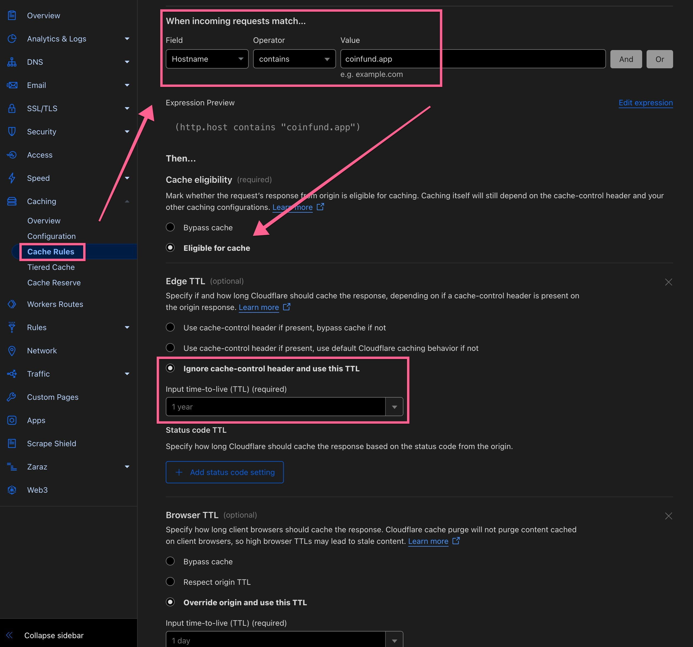
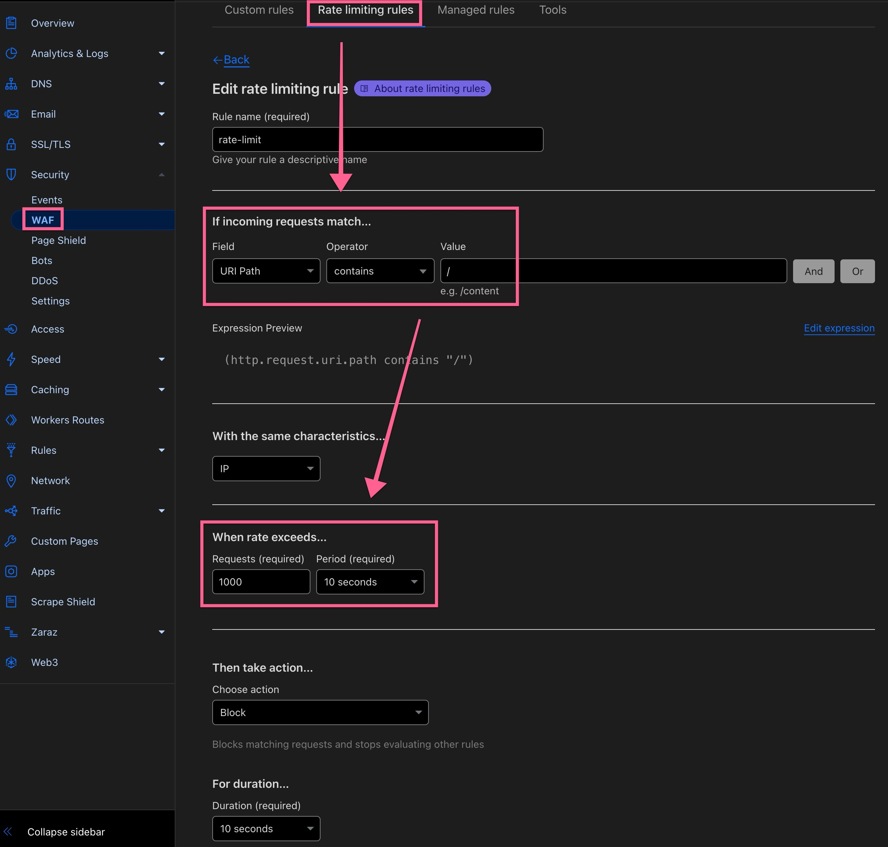

# Nosflare

Nosflare is a serverless [Nostr](https://github.com/fiatjaf/nostr) relay purpose-built for [Cloudflare Workers](https://workers.cloudflare.com/) and a [Cloudflare D1](https://developers.cloudflare.com/d1/) database. You can use a live, paid version of this relay implementation by adding it to your relay list: `wss://relay.nosflare.com`

Most applicable NIPs are supported along with support for "pay to relay", allowlisting or blocklisting pubkeys and event kinds and tags, throttle number of events from a single pubkey through rate limiting, block specific words and/or phrases, and support of [NIP-05](https://github.com/nostr-protocol/nips/blob/master/05.md) for `username@your-domain.com` verified Nostr addresses.

This relay implementation is designed to be easy to deploy, scalable, and cost-effective, leveraging Cloudflare's edge computing infrastructure to provide a resilient relay for the Nostr decentralized social protocol.

Nosflare uses the [Session API](https://developers.cloudflare.com/d1/worker-api/d1-database/#withsession), which enables Cloudflare's global read replication. This can lower latency for read queries and scale read throughput by adding read-only database copies, called read replicas, across regions globally closer to clients.

This relay implementation also uses a multi-regional [Durable Objects](https://developers.cloudflare.com/durable-objects/) mesh network across 9 locations, which is used for long-lived websocket connections and broadcasting new events to all clients. This allows for real-time delivery of new events to all connected clients without the bottleneck of a single Durable Object location.

It also uses the [Websocket Hibernation API](https://developers.cloudflare.com/durable-objects/best-practices/websockets/#websocket-hibernation-api) in order to reduce costs for billable Duration (GB-s) charges with Durable Objects so the billable usage is not incurred during periods of inactivity, but where clients haven't disconnected.

## One-click Deploy

Don't know how to code or operate a server but still want to run your own Nostr relay? Nosflare Deploy is the easiest, no-code, one-click deployment of your very own relay using your own Cloudflare account for a one-time setup fee of 21,420 sats!

You can even make as many updates to your relay as you like after it has been deployed at no extra cost. This is truly democratizing relay ownership! [Deploy here](https://deploy.nosflare.com/)

Or, continue below to manually deploy Nosflare...

## Supported NIPs

- Supports a range of [Nostr Improvement Proposals (NIPs)](https://github.com/fiatjaf/nostr/tree/master/nips), including NIPs 1, 2, 4, 5, 9, 11, 12, 15, 16, 17, 20, 22, 33, 40, 42.

## Getting Started

### Prerequisites

- A [Cloudflare](https://www.cloudflare.com/plans/) account (recommended with Workers paid plan, but free tier available) to enable D1 database and Durable Objects.
- [Node.js](https://nodejs.org/) and npm (for installing dependencies and running the build script).
- (optional) [Wrangler CLI](https://developers.cloudflare.com/workers/cli-wrangler/install-update)

### Dependencies

Nosflare requires the [@noble/curves](https://github.com/paulmillr/noble-curves) package for cryptographic operations, the [@evanw/esbuild](https://github.com/evanw/esbuild) bundler, and [TypeScript](https://www.typescriptlang.org):

```
npm install @noble/curves
npm install -g esbuild typescript wrangler
npm install --save-dev @cloudflare/workers-types @types/node
```

### Building

Either fork this repo or clone it to your machine (but forking is recommended so you can deploy from your own git repo), then either open the project in your favorite text editor or `cd` into its directory, and open `src/config.ts` in a text editor. Edit the contents of `relayInfo` and enable any optional settings as desired by uncommenting them to customize the relay name, icon, limitations, etc.
 
*Optional:*
- In the `src/config.ts` file: Edit the "Pay to relay" settings if you would like to charge people for access to the relay via payment in Bitcoin through a Nostr zap. This feature is enabled by default. You will want to set `PAY_TO_RELAY_ENABLED` to `false` value if you would like to disable it. Edit `relayNpub` with your own npub and enter the desired price in SATS in `RELAY_ACCESS_PRICE_SATS`, Edit `nip05Users` section to add usernames and their hex pubkey for NIP-05 verified Nostr address, Edit the `blockedPubkeys` or `allowedPubkeys ` and `blockedEventKinds` or `allowedEventKinds` to either blocklist or allowlist pubkeys and event kinds, Edit `blockedContent` to block specific words and/or phrases, Edit `excludedRateLimitKinds` to exclude event kinds from rate limiting, Edit the `blockedTags` or `allowedTags` to either blocklist or allowlist tags, and/or Edit the `blockedNip05Domains` or `allowedNip05Domains` to either blocklist or allowlist domains for the NIP-05 validation (see spam filtering note below).

You can find full list of event kinds [here](https://github.com/nostr-protocol/nips#event-kinds) and tags [here](https://github.com/nostr-protocol/nips?tab=readme-ov-file#standardized-tags).

How blocklisting and allowlisting works:
> If pubkey(s) and event kind(s) and tag(s) are in blocklist, only that pubkey(s) and event kind(s) and tag(s) will be blocked and all others allowed. Conversely, if pubkey(s) and event kind(s) and tag(s) are in allowlist, only that pubkey(s) and event kind(s) and tag(s) will be allowed and all others blocked.

*HTML landing page:*

Nosflare has a default static HTML page that renders when someone visits the relay URL from a browser instead of a Nostr client. This landing page is what's used to accept payments for access to the relay (if enabled) as well as show some data about the relay. Customize this as you please, adding your own logo, etc.

*Spam filtering:*

Nosflare has two optional robust spam filtering mechanisms: NIP-05 Nostr address validation and deriving hashes of event content. 

The NIP-05 validation is disabled by default and must be set to `true` in `checkValidNip05` in the `src/config.ts` file and is handled within the `processEvent` function in the `src/relay-worker.ts` file. There you will see the code block for "NIP-05 validation". Furthermore, you can explicitly list domains you'd like to allow or block from publishing events.

Additionally, there's an optional setting `enableAntiSpam` that is disabled by default. Setting it to `true` subjects each event submitted to the relay to generate a hash based on the author's pubkey and the content of the event. A variety of kinds are included in the duplicate checker, but can be removed from the list to skip them. This means, someone could submit an event of a note that says "Hey whatsup" and that'd be the only time that particular pubkey could ever create a single note like that. This prevents someone from repeatedly publishing the exact same note.

As briefly mentioned above, you can change which event kinds are subjected to checking for duplicate hashes in the `antiSpamKinds` array. There you can have more granular control over what event kinds are subjected to the spam filtering. Similar allowlisting/blocklisting logic as explained further above is also relevant here. 

Even further, you can have even more granular control over the spam filtering by changing the value of `enableGlobalDuplicateCheck`. By default, this option is set to `false` value, which means each event submitted to the relay is hashed with the author's pubkey. If set to `true` value it globally hashes the event content. As with the example given earlier, if one person were to write "Hey whatsup" and the value of `enableGlobalDuplicateCheck` is set to `true` then no other person can also write a note with "Hey whatsup" as the hash will already exist and any subsequent events would be denied. This is particularly useful if your relay is under spam attack and the attackers are using disposable pubkeys, but the content of the spam notes are the same for each (such as the attack by "ReplyGuy").

### Deployment

Once you've made the desired edits, from the project's directory within CLI use the command `npm run build` to bundle the worker script. This will use the edited `src/config.ts` file to overwrite the `worker.js` file. You can then either copy the contens of the `worker.js` file and paste it directly into the Worker code editor in the Cloudflare dashboard. Or, if files are git pushed to a repo, you can link the repo to the Worker and it will automatically build using the `worker.js` script to the Worker. Thereafter, any changes saved to the git repo will be pushed to update the Worker automatically.

You can deploy Nosflare using either the Wrangler CLI or directly through the Cloudflare dashboard. We'll focus on a mix of using the Cloudflare dashboard and connected git repo, but many steps for using Wrangler CLI is somewhat similar:

#### Cloudflare Dashboard

1. Log in to your Cloudflare dashboard.
2. Go to Storage & Databases > D1 SQL Database section and click "Create Database" button. Pick any name you want and select the Region.
3. In the newly created D1 database click Settings tab and click "Enable read replication". Ignore the warning, Nosflare has been extensively tested to support read replication. However, fallback support is included in case read replication is disabled.
4. Edit the `wrangler.toml` file to use your own D1 database settings for name and id. The id is the "UUID" listed on the D1 Database dashboard. In this same file you can also change some other settings for the worker, including its name.
6. Go to the Compute (Workers) section and click create button to start a new worker. You can import directly from a git repo or start with "Hello World" template. You can call the worker whatever you'd like. This will be the primary relay worker (the one Nostr clients connect to).
7. If not using a connected git repo, then on the Bindings tab of the Worker, bind the `RELAY_DATABASE` variable to the D1 database you created in the Storage & Databases > D1 SQL Database section. These bindings will occur automatically and can be skipped if pushing from git to the worker.
8. Depending what you picked in step 4, Copy the contents of `worker.js` file and paste into the online editor. Or, if files are git pushed to a repo, the Worker will automatically build from the `worker.js` script to the Worker.
9. Save and deploy the relay worker. Visit the relay URL through HTTP request (from browser) to the landing page. This will trigger the database initialization to build the necessary database tables.
10. Add a custom domain in the Worker's settings in Settings > Domains & Routes section (this will be the desired relay URL).

## Cost Analysis & Pricing

Nosflare typically costs **75-90% less** than traditional relay hosting while providing **better performance**, **global scale**, and **zero maintenance**.

View detailed pricing → [Workers](https://developers.cloudflare.com/workers/platform/pricing/), [Durable Objects](https://developers.cloudflare.com/durable-objects/platform/pricing/), [D1 database](https://developers.cloudflare.com/d1/platform/pricing/)

## Pay To Relay

Nosflare allows for "pay to relay", which lets the relay operator accept Bitcoin lightning payments through Nostr zaps of SATS. The price can be whatever the relay operator chooses and sets detailed above in the optional settings section. This allows relay operators to turn their relay into a paid relay. Once enabled, every event sent to the relay will have its author's pubkey checked to see if they've paid for access.


## Roadmap

The current release of Nosflare is primarily focused on [basic protocol flow](https://github.com/nostr-protocol/nips/blob/master/01.md) usage. This ensures events are stored and retrieved very quickly. However, the following is a non-exhaustive list of planned features:

- [NIP-50](https://github.com/nostr-protocol/nips/blob/master/50.md) for full searchable text
- [NIP-65](https://github.com/nostr-protocol/nips/blob/master/65.md) for replaceable events

## Recommended Cloudflare Settings

Ensure optimal performance of the relay by changing "CPU time limit" in Worker settings to `30000` and creating a Page Rule for enforcing a high cache rate through a "cache everything" rule and lengthy Cloudflare edge TTL as well as enabling rate limiting in order to protect the relay from abuse.

Examples:





## Send It "Blaster"

Attached in this repo is the `send-it.js` file which includes the code for the `wss://sendit.nosflare.com` relay that "blasts" your note to as many online relays as possible, using [NIP-66](https://github.com/nostr-protocol/nips/blob/master/66.md).

## Contributing

Contributions to Nosflare are welcome! Please submit issues, feature requests, or pull requests through the project's GitHub repo.

## License

Nosflare is open-sourced software licensed under the MIT license.

## Contact

For inquiries related to Nosflare, you can start a discussion on the GitHub repo or reach out on Nostr:    

 </img>    
 
`npub16jdfqgazrkapk0yrqm9rdxlnys7ck39c7zmdzxtxqlmmpxg04r0sd733sv`

## Changelog

See the `CHANGELOG.md` file for versioning [here](/CHANGELOG.md).