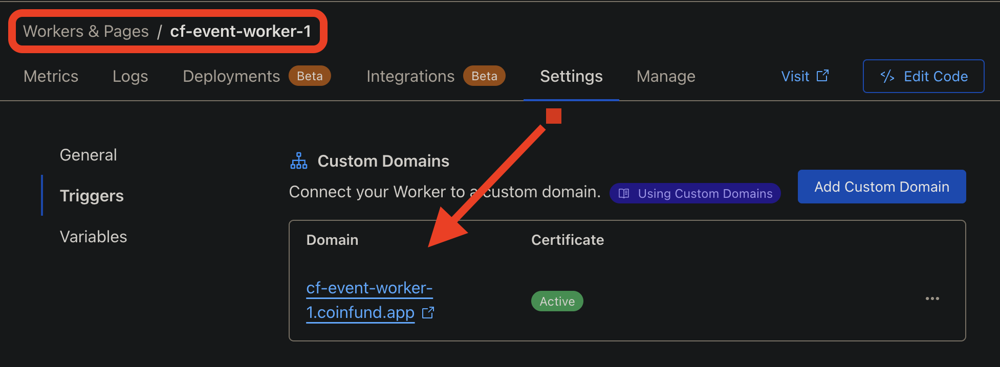
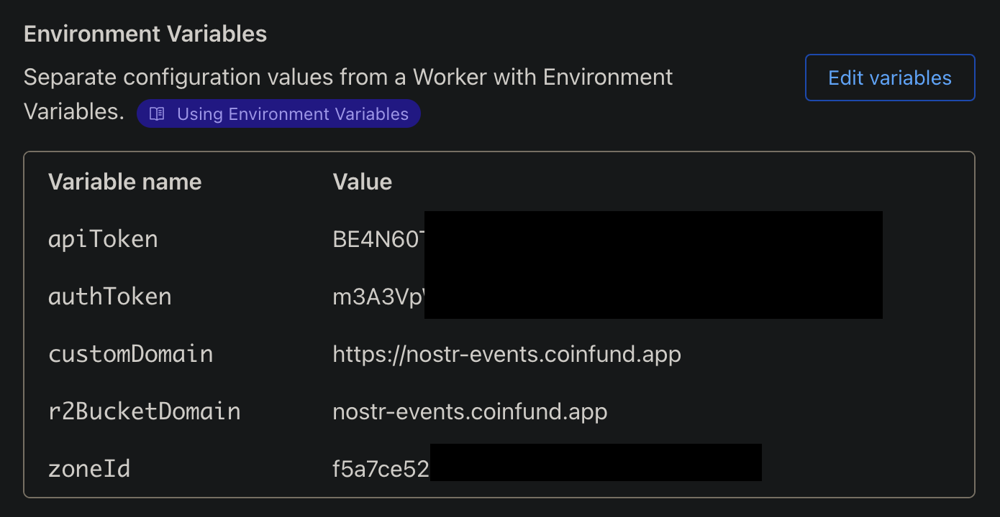

# Nosflare

Nosflare is a serverless [Nostr](https://github.com/fiatjaf/nostr) relay purpose-built for [Cloudflare Workers](https://workers.cloudflare.com/) and a [Cloudflare R2](https://www.cloudflare.com/developer-platform/r2/) bucket. You can use a live version of this relay implementation by adding it to your relay list: `wss://relay.nosflare.com`

This relay is designed to be easy to deploy, scalable, and cost-effective, leveraging Cloudflare's edge computing infrastructure to provide a resilient relay for the Nostr decentralized social protocol.

Most applicable NIPs are supported along with support for allowlisting or blocklisting pubkeys and event kinds and tags, throttle number of events from a single pubkey through rate limiting, block specific words and/or phrases, and support of [NIP-05](https://github.com/nostr-protocol/nips/blob/master/05.md) for `username@your-domain.com` verified Nostr addresses.

Nosflare introduces a unique "helper" scheme which allows utilizing helper workers for handling EVENT and REQ messages. This let's the primary websocket worker communicate with helper workers in order to improve the saving and retrieval of events to and from the R2 bucket. At least one helper worker for both EVENT and REQ messages is required, detailed further in the Deployment section.

These helper workers communicate with the primary relay websocket worker through POST requests. This means, you can technically query your R2 bucket using standard HTTP POST requests like this example using cURL:

<code>curl -X POST -H "Content-Type: application/json" -H "Authorization: Bearer AuthToken123" -d '{"type":"REQ","subscriptionId":"sub1","filters":{"kinds":[1]}}' "https://req-helper-1.example.com"</code>

This opens up many possibilities for the relay to share event data outside of a Nostr client. By default, Nosflare is configured to use an Authorization header to secure and authenticate the inter-relay communication between websocket worker and helper workers in order to prevent abuse. However, you could alter the code if you'd like to remove this restriction.

## Supported NIPs

- Supports a range of [Nostr Improvement Proposals (NIPs)](https://github.com/fiatjaf/nostr/tree/master/nips), including NIPs 1, 2, 4, 5, 9, 11, 12, 15, 16, 17, 20, 22, 33, 40.

## Getting Started

### Prerequisites

- A [Cloudflare](https://www.cloudflare.com/plans/) account with Workers and R2 bucket enabled.
- [Node.js](https://nodejs.org/) and npm (for installing dependencies and running the build script).
- (optional) [Wrangler CLI](https://developers.cloudflare.com/workers/cli-wrangler/install-update)

### Dependencies

Nosflare requires the [@noble/curves](https://github.com/paulmillr/noble-curves) package for cryptographic operations and the [@evanw/esbuild](https://github.com/evanw/esbuild) bundler:

```
npm install @noble/curves
npm install -g esbuild
```

### Building

Clone this repo to your machine, then `cd` into its directory, and open `relay-worker.js` in a file editor. Edit the contents of `relayInfo` and `relayIcon` as desired to customize the relay name, icon, etc.

***Important!*** Edit the `eventHelpers` and `reqHelpers` section by replacing the placeholder URLs with at least one URL for each. Detailed further in the Deployment steps below.
 
*Optional:*
- In the `relay-worker.js` file: Edit the "Pay to relay configuration" if you would like to charge people for access to the relay. You will want to set `PAY_TO_RELAY_ENABLED` to `true` state, edit `relayNpub` with your own npub and enter the desired price in SATS to `RELAY_ACCESS_PRICE_SATS` and set your own relay URL in `const relayUrl = `${protocol}//${server.url || 'relay.nosflare.com'}`;` by replacing Nosflare's URL, Edit `nip05Users` section to add usernames and their hex pubkey for NIP-05 verified Nostr address, Edit the `blockedPubkeys` or `allowedPubkeys ` and `blockedEventKinds` or `allowedEventKinds` to either blocklist or allowlist pubkeys and event kinds, Edit `blockedContent` to block specific words and/or phrases, Edit `excludedRateLimitKinds` to exclude event kinds from rate limiting, Edit the `blockedTags` or `allowedTags` to either blocklist or allowlist tags, and/or Edit the `blockedNip05Domains` or `allowedNip05Domains` to either blocklist or allowlist domains for the NIP-05 validation (see spam filtering note below).

You can find full list of event kinds [here](https://github.com/nostr-protocol/nips#event-kinds) and tags [here](https://github.com/nostr-protocol/nips?tab=readme-ov-file#standardized-tags).

How blocklisting and allowlisting works:
> If pubkey(s) and event kind(s) and tag(s) are in blocklist, only that pubkey(s) and event kind(s) and tag(s) will be blocked and all others allowed. Conversely, if pubkey(s) and event kind(s) and tag(s) are in allowlist, only that pubkey(s) and event kind(s) and tag(s) will be allowed and all others blocked.

*HTML landing page:*

Nosflare has a default static HTML page that renders when someone visits the relay URL from a browser instead of a Nostr client. This landing page is what's used to accept payments for access to the relay (if enabled) as well as show some data about the relay. Customize this as you please, adding your own logo, etc.

*Spam filtering:*

Nosflare has two optional robust spam filtering mechanisms: NIP-05 Nostr address validation and deriving hashes of event content. 

The NIP-05 validation is enabled by default and is located within the `processEventInBackground` function in the `relay-worker.js` file. There you will see the code block for "NIP-05 validation", which you can either leave intact or remove/comment to disable validating NIP-05 address. Furthermore, within the `relay-worker.js` file you can explicitly list domains you'd like to allow or block from publishing events.

Additionally, each event submitted to the relay generates a hash based on the author's pubkey and the content of the event, which is stored within the "hashes" directory of the R2 bucket. By default, in the `event-worker.js` file it is set to bypass all event kinds (effectively disabled). However, it can be configured to remove specific events kinds from being bypassed, which would allow only 1 of the same hash per pubkey. This means, someone could submit an event of a note that says "Hey whatsup" and that'd be the only time that particular pubkey could ever create a single note like that. This prevents someone from repeatedly publishing the exact same note.

As briefly mentioned above, you can change which event kinds are subjected to checking for duplicate hashes in the `bypassDuplicateKinds` and `duplicateCheckedKinds` arrays in the `event-worker.js` file. There you can have more granular control over what event kinds are subjected to the spam filtering. Similar allowlisting/blocklisting logic as explained further above is also relevant here. Effectively, these sections are where you can enable or disable the spam filtering.

Furthermore, you can have even further granular control over the spam filtering by changing the value of `enableGlobalDuplicateCheck` in the `event-worker.js` file. By default, this option is set to `false` value, which means each event submitted to the relay is hashed with the author's pubkey. If set to `true` value it globally hashes the event content. As with the example given earlier, if one person were to write "Hey whatsup" and the value of `enableGlobalDuplicateCheck` is set to `true` then no other person can also write a note with "Hey whatsup" as the hash will already exist and any subsequent events would be dropped. This is particularly useful if your relay is under spam attack and the attackers are using disposable pubkeys, but the content of the spam notes are the same for each (such as the attack by "ReplyGuy").

### Deployment

Once you've made the desired edits, from the project's directory within CLI use the command `npm run build` to bundle the worker scripts. This will overwrite the `relay-worker.js`, `event-worker.js`, and `req-worker.js` files and save them in the `dist/` directory. You will use these three scripts from the `dist/` directory to deploy the relay.

You can deploy Nosflare using either the Wrangler CLI or directly through the Cloudflare dashboard. We'll focus on using the Cloudflare dashboard, but many steps for using Wrangler CLI is somewhat similar:

#### Cloudflare Dashboard

1. Log in to your Cloudflare dashboard.
2. Go to the Workers section and create a new worker. You can call it whatever you'd like. This will be the primary relay worker (the one Nostr clients connect to).
3. Copy the contents of `dist/relay-worker.js` file and paste into the online editor.
4. Save and deploy the relay worker.
5. Add a custom domain in the relay Worker's settings in "Triggers" tab (this will be the desired relay URL).
6. Create another worker. You can call it whatever you'd like. This will be the EVENT messages helper worker.
7. Copy the contents of `dist/event-worker.js` file and paste into the online editor.
8. Save and deploy the events helper worker.
9. Add custom subdomain in Worker's settings in "Triggers" tab (this will be the desired URL used for `eventHelpers`). Repeat this step if you want to create multiple event helper workers!
10. Create another worker. You can call it whatever you'd like. This will be the REQ messages helper worker.
11. Copy the contents of `dist/req-worker.js` file and paste into the online editor.
12. Save and deploy the req helper worker.
13. Add custom subdomain in Worker's settings in "Triggers" tab (this will be the desired URL used for `reqHelpers`). Repeat this step if you want to create multiple req helper workers!

14. Create a R2 bucket to store events. You can call it whatever and choose the location you want.
15. In R2 bucket settings, add a custom subdomain (ex: nostr-events.site.com).

16. In each Worker's variables settings add the following environment variables: `r2BucketDomain` that will be the subdomain URL you set as the custom domain in the R2 bucket, `authToken` this will be something unique (think password) that will be used to authenticate the communication from the relay worker to the helper workers, `apiToken` this will be your cloudflare API token (recommended to set a custom API token that only has cache purge privileges), `zoneId` which is for the domain you're using for the R2 bucket (this ID can be found in the right sidebar of the overview page for the domain).

17. In a different section on the Settings > Variables page of each worker, bind the `relayDb` variable to the R2 bucket you created in the R2 Bucket Bindings section.


## Pay to relay

Nosflare allows for "pay to relay", which lets the relay operator accept Bitcoin lightning payments through Nostr zaps of SATS. The price can be whatever the relay operator chooses and sets detailed above in the optional settings section. This allows relay operators to turn their relay into a paid relay. Once enabled, every event sent to the relay will have its author's pubkey checked to see if they've paid for access.

## Bucket Pruning

Cloudflare's R2 bucket support data pruning through "Object Lifecycle Rules". This can be tuned to delete selected data after a certain time. This makes it possible to automatically "nuke" events after 24hrs or 30 days or a year or whatever length of time you'd like. Read more [here](https://developers.cloudflare.com/r2/buckets/object-lifecycles/).

## Roadmap

The current release of Nosflare is primarily focused on [basic protocol flow](https://github.com/nostr-protocol/nips/blob/master/01.md) usage. This ensures events are stored and retrieved very quickly. However, the following is a non-exhaustive list of planned features:

- [NIP-50](https://github.com/nostr-protocol/nips/blob/master/50.md) for full searchable text
- [NIP-65](https://github.com/nostr-protocol/nips/blob/master/65.md) for replaceable events

## Recommended Cloudflare Settings

Ensure optimal performance of the relay by creating a Page Rule for enforcing a high cache rate through a "cache everything" rule and lengthy Cloudflare edge TTL as well as enabling rate limiting in order to protect the relay from abuse.

Examples:


## Send It "Blaster"

Attached in this repo is the `send-it.js` file which includes the code for the `wss://sendit.nosflare.com` relay that "blasts" your note to as many online relays as possible, using [NIP-66](https://github.com/nostr-protocol/nips/blob/master/66.md).

## Contributing

Contributions to Nosflare are welcome! Please submit issues, feature requests, or pull requests through the project's GitHub repo.

## License

Nosflare is open-sourced software licensed under the MIT license.

## Contact

For inquiries related to Nosflare, you can start a discussion on the GitHub repo or reach out on Nostr:    

 </img>    
 
`npub16jdfqgazrkapk0yrqm9rdxlnys7ck39c7zmdzxtxqlmmpxg04r0sd733sv`

## Changelog

See the `changelog.md` file for versioning.