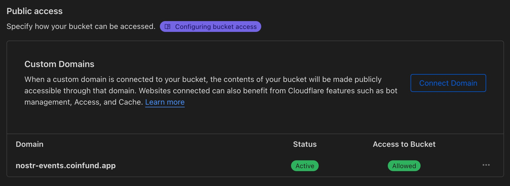
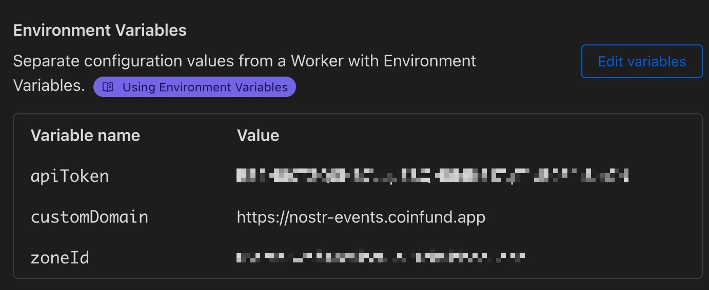
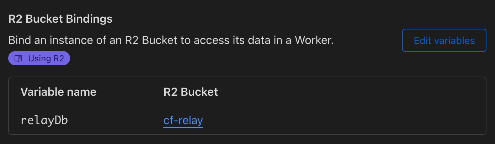

# Nosflare

Nosflare is a serverless [Nostr](https://github.com/fiatjaf/nostr) relay purpose-built for [Cloudflare Workers](https://workers.cloudflare.com/) and a [Cloudflare R2](https://www.cloudflare.com/developer-platform/r2/) bucket. 

This relay is designed to be easy to deploy, scalable, and cost-effective, leveraging Cloudflare's edge computing infrastructure to provide a resilient relay for the Nostr decentralized social  protocol.

Most applicable NIPs are supported along with support for allowlisting or blocklisting pubkeys and event kinds, throttle number of events from a single pubkey through rate limiting, block specific words or phrases, blast events to other relays, and support of [NIP-05](https://github.com/nostr-protocol/nips/blob/master/05.md) for `username@your-domain.com` verified Nostr addresses.

## Supported NIPs

- Supports a range of [Nostr Improvement Proposals (NIPs)](https://github.com/fiatjaf/nostr/tree/master/nips), including NIPs 1, 2, 4, 5, 9, 11, 12, 15, 16, 17, 20, 22, 33, and 40.

## Getting Started

### Prerequisites

- A [Cloudflare](https://www.cloudflare.com/plans/) account with Workers and R2 bucket enabled.
- [Node.js](https://nodejs.org/) and npm (for installing dependencies and running the build script).
- (optional) [Wrangler CLI](https://developers.cloudflare.com/workers/cli-wrangler/install-update) or access to the Cloudflare dashboard for deployment.

### Dependencies

Nosflare requires the [@noble/curves](https://github.com/paulmillr/noble-curves) package for cryptographic operations and the [@evanw/esbuild](https://github.com/evanw/esbuild) bundler:

```
npm install @noble/curves
npm install -g esbuild
```

### Building

Clone the repo to your machine and open `worker.js` in a file editor. Edit the contents of `relayInfo` and `relayIcon` as desired to customize the relay name, icon, etc.
 
*Optional:*
- Edit the `nip05Users` section to add usernames and their hex pubkey for NIP-05 verified Nostr address.
- Edit the `blockedPubkeys` or `allowedPubkeys ` and `blockedEventKinds` or `allowedEventKinds` to either blocklist or allowlist pubkeys and event kinds.
- Edit `blockedContent` to block specific words and/or phrases.
- Edit `blastRelays` to specify other relays for blasting events.
- Edit `excludedRateLimitKinds` to exclude event kinds from rate limiting.

> How blocklisting and allowlisting works: If pubkey(s) or event kind(s) is in blocklist, only that pubkey(s) or event kind(s) will be blocked and all others allowed. Conversely, if pubkey(s) or event kind(s) is in allowlist, only that pubkey(s) and event kind(s) will be allowed and all others blocked.

We'll use `esbuild` to bundle the worker script:

```
esbuild worker.js --bundle --outfile=dist/worker.js --platform=neutral --target=es2020
```

The command assumes you're in the same directory as the `worker.js` file.

### Deployment

You can deploy Nosflare using either the Wrangler CLI, directly through the Cloudflare dashboard, or with the third-party deployment script:

#### Cloudflare Dashboard

1. Log in to your Cloudflare dashboard.
2. Go to the Workers section and create a new worker. You can call it whatever you'd like.
3. Copy the contents of `dist/worker.js` and paste into the online editor. See the `example.js` file in this repo for what a successfully bundled file should look like.
4. Save and deploy the worker.
5. Add a custom domain in Worker's settings (this will be the desired relay URL).
6. Create a R2 bucket to store events. You can call it whatever you want.
7. In R2 bucket settings, add a custom subdomain (ex: nostr-events.site.com).
8. In the Worker's variables settings add the following environment variables: `customDomain` that will be the subdomain URL you set in bucket, `apiToken` this will be your cloudflare API token (recommended to set a custom API token that only has cache purge privileges), `zoneId` which is for the domain you're using for the R2 bucket (this ID can be found in the right sidebar of the overview page for the domain).
9. In a different section on the Settings > Variables page, bind the `relayDb` variable to the R2 bucket you created in the R2 Bucket Bindings section.

Examples:







#### Wrangler CLI

1. Configure your `wrangler.toml` with your Cloudflare account details.
2. Publish the worker:

```
wrangler publish
```
3. Add a custom domain in Worker's settings (this will be the desired relay URL).
4. Create a R2 bucket to store events. You can call it whatever you want.
5. In R2 bucket settings, add a custom subdomain (ex: nostr-events.site.com).
6. In the Worker's variables settings add the following environment variables: `customDomain` that will be the subdomain URL you set in bucket, `apiToken` this will be your cloudflare API token (recommended to set a custom API token that only has cache purge privileges), `zoneId` which is for the domain you're using for the R2 bucket (this ID can be found in the right sidebar of the overview page for the domain).
7. In a different section on the Settings > Variables page, bind the `relayDb` variable to the R2 bucket you created in the R2 Bucket Bindings section.

#### NosflareDeploy Script

A third-party script to easily deploy Nosflare. Read more [here](https://github.com/PastaGringo/NosflareDeploy). 

## Usage

Nosflare acts as a Nostr relay. Users can connect using any standard Nostr client by pointing to the deployed Cloudflare Worker URL or custom domain. The relay adheres to the basic tenets of the Nostr protocol, handling events according to the specified NIPs above.

As mentioned, you can either use the Cloudflare Worker's default "workers.dev" endpoint URL or a custom domain, adding it to any Nostr client using the secure websocket protocol.

Example:

- `wss://nostr-relay.example.workers.dev/`

## Roadmap

The current release of Nosflare is primarily focused on [basic protocol flow](https://github.com/nostr-protocol/nips/blob/master/01.md) usage. This ensures events are stored and retrieved very quickly. However, the following is a non-exhaustive list of planned features:

- Event streaming
- "Pay-to-relay" (charging sats for access)
- Client authorization (NIP-42)
- Encrypted DMs (NIP-44)

## Recommended Cloudflare Settings

Ensure optimal performance of the relay by enforcing a high cache rate and lengthy Cloudflare edge TTL as well as enabling rate limiting in order to protect the relay from abuse.

Examples:


## Contributing

Contributions to Nosflare are welcome! Please submit issues, feature requests, or pull requests through the project's [GitHub repository](https://github.com/Spl0itable/nosflare).

## License

Nosflare is open-sourced software licensed under the MIT license.

## Contact

For inquiries related to Nosflare, you can reach out on Nostr at `npub16jdfqgazrkapk0yrqm9rdxlnys7ck39c7zmdzxtxqlmmpxg04r0sd733sv`

## Acknowledgements

- The awesome Nostr community for the protocol development.
- Cloudflare Workers for an easy-to-use serverless execution environment.
- The noble library for providing Schnorr signatures over secp256k1.
- [PastaGringo](https://github.com/PastaGringo) for making the NosflareDeploy script.