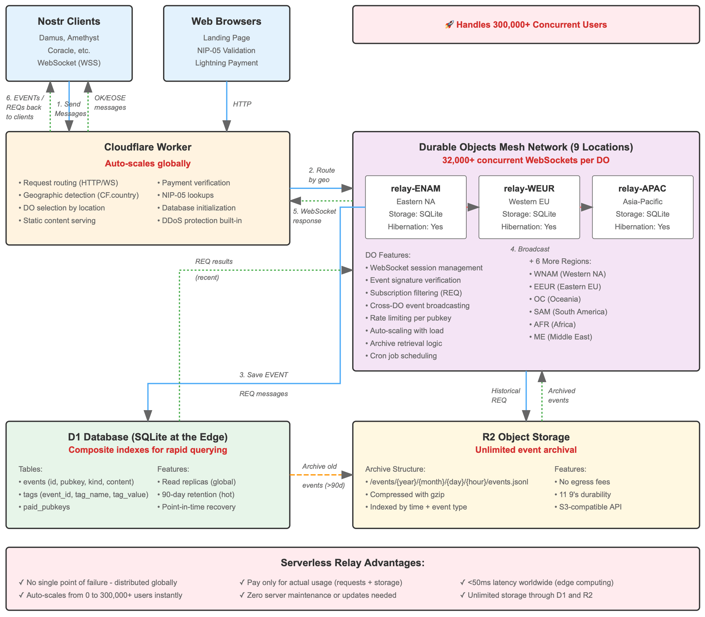

# Nosflare

Nosflare is a serverless [Nostr](https://github.com/fiatjaf/nostr) relay built on Cloudflare's infrastructure using "CFNDB" a custom-built "Cloudflare Nostr Database", which comprises of [Workers](https://developers.cloudflare.com/workers/), [Durable Objects](https://developers.cloudflare.com/durable-objects/), [Queues](https://developers.cloudflare.com/queues/), and [R2 Object Storage](https://developers.cloudflare.com/r2/). This implementation uses a distributed, sharded Durable Objects architecture for event storage, subscription management, and broadcasting for maximum horizontal scaling. A live, paid instance is available at `wss://relay.nosflare.com`.

The relay supports pay-to-relay functionality, allowlisting and blocklisting of pubkeys, event kinds and tags, per-pubkey rate limiting, content filtering, and [NIP-05](https://github.com/nostr-protocol/nips/blob/master/05.md) verified Nostr addresses.

## Architecture



CFNDB replaces a traditional SQL database with co-located, in-memory indices stored directly within Durable Objects, and uses "NIN" for "Nostr Indexation Natively". Instead of storing events in database tables and running SQL queries, NIN maintains native index structures alongside events in each Durable Object. NIN is purpose-built for Nostr's specific query patterns (kinds, authors, tags, time ranges).

**Why It's Faster:**
- No query parsing - Direct Map lookups instead of SQL parsing/planning
- No disk I/O per query - Indices live in memory, lazy-loaded on demand
- No JOINs - Set intersections on pre-built indices
- Time-sorted by design - Binary search for time ranges
- Co-located data - Events and indices in same Durable Object

### Durable Objects

**ConnectionDO** (One per WebSocket connection)
- Handles individual client WebSocket connections using the [Hibernation API](https://developers.cloudflare.com/durable-objects/best-practices/websockets/#websocket-hibernation-api)
- Manages local subscription state and filter matching
- Processes EVENT, REQ, CLOSE, and AUTH messages
- Routes events to broadcast queues after validation

**SessionManagerDO** (configurable shards, default 50)
- Centralized subscription tracking across all connections
- In-memory indices for kind, author, and tag subscriptions
- Sharded by kind (`kind % SESSION_MANAGER_SHARD_COUNT`) for parallel query execution
- Provides O(1) subscription lookups during event broadcast
- Requires `kinds` filter in all subscriptions to enable targeted sharding

**BroadcastShardDO** (Dynamic instances)
- Distributes events to matching ConnectionDO instances
- Groups sessions into batches of 900 to stay under Cloudflare's 1000 subrequest limit
- Receives pre-serialized JSON to avoid redundant serialization

**EventShardDO** (Time-based shards with configurable replicas)
- 24-hour time windows for event storage
- Configurable read replicas per shard (`READ_REPLICAS_PER_SHARD`, default 4)
- Configurable query time range (`MAX_TIME_WINDOWS_PER_QUERY`, default 7 days)
- In-memory indices: kind, author, tag, created_at, composite indices
- Index limits: 100,000 per kind/author/tag index, 500,000 for global time-sorted index
- Supports NIP-09 deletions, NIP-16 replaceable events, NIP-33 addressable events, NIP-50 search

**PaymentDO**
- Tracks paid pubkeys for pay-to-relay functionality

### Queues

**Broadcast Queues** (50 queues)
- Sharded by event kind (`kind % SESSION_MANAGER_SHARD_COUNT`)
- Enables targeted SessionManagerDO queries (only relevant shards)
- Pre-serializes events once for all subscribers

**Indexing Queues** (200 queues)
- 50 queues per read replica type
- Hash-based sharding by event ID
- Batch processing up to 100 events per batch

**R2 Archive Queue**
- Rate-limited writes to R2 (respects ~1000 req/sec limit)
- Decouples indexing latency from archive storage
- Automatic retries via dead-letter queue

## Supported NIPs

This relay implements the following [Nostr Improvement Proposals (NIPs)](https://github.com/nostr-protocol/nips):

- NIP-01: Basic protocol flow
- NIP-02: Contact List and Petnames
- NIP-04: Encrypted Direct Messages
- NIP-05: Mapping Nostr keys to DNS-based internet identifiers
- NIP-09: Event Deletion
- NIP-11: Relay Information Document
- NIP-12: Generic Tag Queries
- NIP-15: Marketplace
- NIP-16: Event Treatment (Replaceable Events)
- NIP-17: Private Direct Messages
- NIP-20: Command Results
- NIP-22: Event created_at Limits
- NIP-23: Long-form Content
- NIP-33: Parameterized Replaceable Events
- NIP-40: Expiration Timestamp (with automatic cleanup)
- NIP-42: Authentication of clients to relays
- NIP-50: Search Capability
- NIP-51: Lists
- NIP-58: Badges
- NIP-65: Relay List Metadata
- NIP-71: Video Events
- NIP-78: Application-specific data
- NIP-89: Recommended Application Handlers
- NIP-94: File Metadata

## One-click Deploy

Deploy your own Nostr relay using your Cloudflare account with [Nosflare Deploy](https://deploy.nosflare.com/) for a one-time setup fee. Updates to your relay configuration are included at no extra cost.

For manual deployment, continue below.

## Getting Started

### Prerequisites

- A [Cloudflare](https://www.cloudflare.com/plans/) account with Workers paid plan (required for Durable Objects, Queues, and R2)
- [Node.js](https://nodejs.org/) and npm
- [Wrangler CLI](https://developers.cloudflare.com/workers/wrangler/install-and-update/)

### Dependencies

Install the required packages:

```bash
npm install
```

Core dependencies include:
- **@noble/curves**: Cryptographic operations for signature verification
- **msgpackr**: Binary serialization for internal DO-to-DO communication
- **esbuild**: Bundler for production builds
- **wrangler**: Cloudflare Workers deployment tool

### Configuration

Fork or clone this repository. Edit `src/config.ts` to configure relay settings:

**Required Configuration:**
- `relayInfo`: Set relay name, description, pubkey, contact information, and supported features
- `relayNpub`: Your npub for receiving payments (if pay-to-relay is enabled)
- `auth_required`: By default, NIP-42 authentication is disabled. Choose whether to enable it

**Optional Settings:**

*Pay-to-Relay:*
- Set `PAY_TO_RELAY_ENABLED` to `false` to disable payment requirements
- Configure `RELAY_ACCESS_PRICE_SATS` to set the relay access price in satoshis

*Access Control:*
- `blockedPubkeys` / `allowedPubkeys`: Control which public keys can publish events
- `blockedEventKinds` / `allowedEventKinds`: Filter event types ([event kinds reference](https://github.com/nostr-protocol/nips#event-kinds))
- `blockedTags` / `allowedTags`: Filter by event tags ([tags reference](https://github.com/nostr-protocol/nips?tab=readme-ov-file#standardized-tags))
- `blockedContent`: Block events containing specific words or phrases

For blocklists and allowlists: if the allowlist is populated, only those items are permitted. If the blocklist is populated, only those items are denied. Both cannot be used simultaneously for the same category.

*NIP-05 Verification:*
- `nip05Users`: Map usernames to hex pubkeys for verified addresses
- `checkValidNip05`: Require valid NIP-05 addresses for publishing (anti-spam)
- `blockedNip05Domains` / `allowedNip05Domains`: Filter by NIP-05 domain

*Rate Limiting:*
- `PUBKEY_RATE_LIMIT`: Limit EVENT messages per pubkey (default: 10/minute)
- `REQ_RATE_LIMIT`: Limit REQ messages per connection (default: 100/minute)
- `excludedRateLimitKinds`: Exempt specific event kinds from rate limiting

*Horizontal Scaling:*

These settings control how the relay distributes work across Durable Objects. Lower values reduce DO requests (lower cost) but reduce parallelism. Higher values increase parallelism but generate more internal requests.

**What is Sharding?**

Sharding is a database architecture pattern that partitions data across multiple independent instances (shards) to distribute load and enable horizontal scaling. In Nosflare, sharding is applied to Durable Objects:

- **ConnectionDO sharding**: When enabled (default), each WebSocket connection gets its own Durable Object instance. This provides complete isolation between connections but creates many DO instances. When disabled, all connections share a single DO instance, reducing instance count but increasing per-instance resource usage.

- **SessionManagerDO sharding**: Events are distributed across shards using `kind % SESSION_MANAGER_SHARD_COUNT`. This enables parallel subscription matching across event kinds.

- **EventShardDO sharding**: Events are stored in 24-hour time-based shards with configurable read replicas. This enables parallel querying across time ranges and provides redundancy.

- **PaymentDO sharding**: When enabled, paid pubkeys are distributed across shards based on the first 4 characters of the pubkey. When disabled, all payment records go to a single DO instance.

| Setting | Location | Default | Description |
|---------|----------|---------|-------------|
| `CONNECTION_DO_SHARDING_ENABLED` | `src/config.ts` | true | When true, each WebSocket connection gets its own ConnectionDO. When false, all connections share a single ConnectionDO. |
| `SESSION_MANAGER_SHARD_COUNT` | `src/config.ts` | 50 | Number of SessionManagerDO shards. Events are assigned using `kind % count`. Range: 1-50. |
| `MAX_TIME_WINDOWS_PER_QUERY` | `src/config.ts` | 30 | Maximum days of EventShardDO shards queried per REQ. Each day = 1 shard query. |
| `READ_REPLICAS_PER_SHARD` | `src/config.ts` | 4 | Number of EventShardDO replicas per time shard. Each event write goes to all replicas. |
| `PAYMENT_DO_SHARDING_ENABLED` | `src/config.ts` | true | When true, paid pubkeys are sharded by first 4 chars of pubkey. When false, uses single PaymentDO. |

**Tuning Guidelines:**

- **Low traffic relay**: Set `CONNECTION_DO_SHARDING_ENABLED` to false, `SESSION_MANAGER_SHARD_COUNT` to 1-5, `MAX_TIME_WINDOWS_PER_QUERY` to 3, `READ_REPLICAS_PER_SHARD` to 2, `PAYMENT_DO_SHARDING_ENABLED` to false
- **High traffic relay**: Use defaults (true, 50, 30, 4, true) for maximum parallelism
- **Cost optimization**: Reducing these values significantly decreases Durable Object requests

**Note:** All REQ subscriptions must include a `kinds` filter. Subscriptions without kinds are rejected to prevent broadcast fan-out to all shards.

**Build Command:**

```bash
npm run build
```

This bundles the TypeScript source into `worker.js` for deployment.

### Deployment

Deploy using Wrangler CLI or the Cloudflare dashboard with git integration.

#### Using Wrangler CLI

1. **Create R2 Bucket:**
   ```bash
   wrangler r2 bucket create nostr-archive
   ```

2. **Create Queues:**
   ```bash
   ./scripts/setup-queues.sh
   ```
   This creates all 254 queues: 50 broadcast, 200 indexing (4 replicas x 50), 3 dead-letter queues, and 1 R2 archive queue.

3. **Update wrangler.toml:**
   - Set the `bucket_name` under `[[r2_buckets]]` to match your R2 bucket name
   - Optionally change the worker `name`

4. **Deploy:**
   ```bash
   npm run deploy
   ```

#### Using Cloudflare Dashboard

1. **Create R2 Bucket:**
   - Navigate to R2 Object Storage
   - Create a bucket (e.g., "nostr-archive")
   - Note the bucket name

2. **Create Queues:**
   Run `./scripts/setup-queues.sh` or manually create queues matching the bindings in `wrangler.toml`

3. **Update wrangler.toml:**
   - Set `bucket_name` to your R2 bucket name
   - Optionally modify the worker name

4. **Deploy Worker:**
   - Create a new Worker in the Cloudflare dashboard
   - Connect your git repository for automatic deployments, or manually paste `worker.js` contents
   - Bindings defined in `wrangler.toml` will be automatically configured

5. **Add Custom Domain:**
   - Navigate to Settings > Domains & Routes
   - Add your custom domain (e.g., `wss://relay.yourdomain.com`)

## Pricing

CFNDB operates on Cloudflare's usage-based pricing model. The Workers Paid plan ($5/month minimum) is recommeneded for a production relay with Durable Objects, Queues, and R2 access.

Actual costs depend on relay traffic, event volume, query patterns, and storage requirements. Consult the official Cloudflare pricing documentation for current rates:
- [Workers Pricing](https://developers.cloudflare.com/workers/platform/pricing/)
- [Durable Objects Pricing](https://developers.cloudflare.com/durable-objects/platform/pricing/)
- [R2 Pricing](https://developers.cloudflare.com/r2/pricing/)
- [Queues Pricing](https://developers.cloudflare.com/queues/platform/pricing/)

The Workers Free plan can be used for development and testing but does not support Durable Objects required for production relay operation.

## Performance Characteristics

CFNDB's architecture is designed for high throughput:

- **Write Throughput**: 50 broadcast queues x 5,000 msg/sec = 250,000 events/sec capacity
- **Event Storage**: 1 24hr shard per day x 4 read replicas = 4 EventShardDO instances per day
- **Index Capacity**: 100,000 entries per kind/author/tag index, 500,000 for global time-sorted queries

Query performance depends on filter specificity. Queries with kind, author, or tag filters use O(1) index lookups. All subscriptions must specify a `kinds` filter to enable efficient shard-targeted broadcasting.

## Pay To Relay

Nosflare supports pay-to-relay functionality, allowing relay operators to accept Bitcoin lightning payments through Nostr zaps. Configure the price in `src/config.ts`. When enabled, every event submission checks whether the author's pubkey has paid for access.


## Recommended Cloudflare Settings

**Worker CPU Limits:**
The default CPU time limit in `wrangler.toml` is set to `300000` milliseconds (5 minutes). Adjust this value based on your plan limits:
- Workers Paid plan: Up to 300,000ms (5 minutes)
- Workers Free plan: 10ms limit (not suitable for production relay use)

**Caching and Rate Limiting:**
Configure cache rules and rate limiting to optimize performance and protect against abuse. Refer to Cloudflare documentation for Page Rules and Rate Limiting configuration appropriate for WebSocket-based applications.

## Send It "Blaster"

Included in this repo is `send-it.js`, the code for `wss://sendit.nosflare.com` that broadcasts notes to as many online relays as possible using [NIP-66](https://github.com/nostr-protocol/nips/blob/master/66.md).

## Contributing

Contributions to Nosflare are welcome. Please submit issues, feature requests, or pull requests through the project's GitHub repository.

## License

Nosflare is open-sourced software licensed under the MIT license.

## Contact

For inquiries related to Nosflare, start a discussion on the GitHub repo or reach out on Nostr:

 </img>

`npub16jdfqgazrkapk0yrqm9rdxlnys7ck39c7zmdzxtxqlmmpxg04r0sd733sv`

## Changelog

See the `CHANGELOG.md` file for versioning [here](/CHANGELOG.md).
